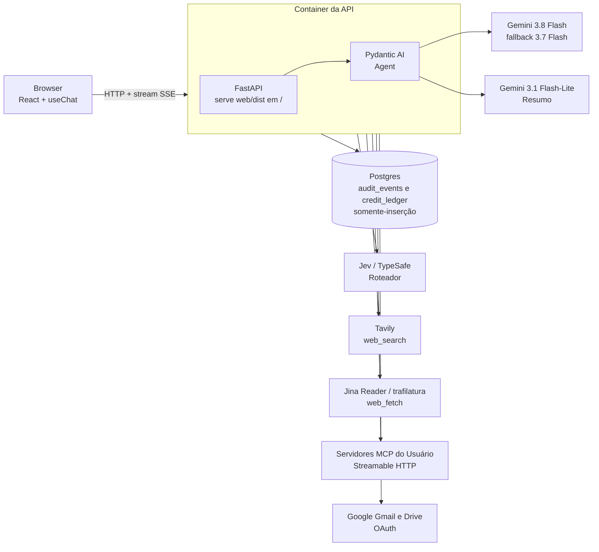
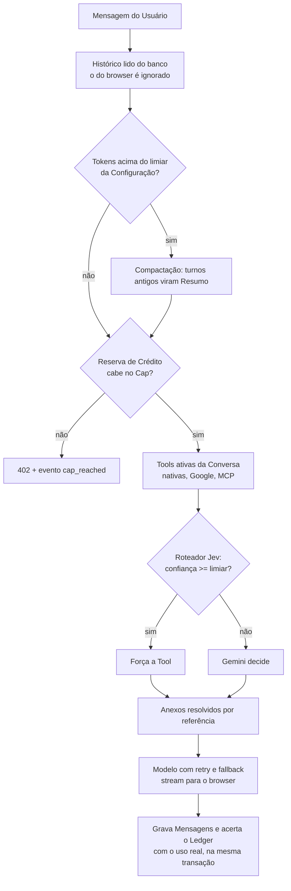

# tess-chat

Chat com LLM: tools nativas e MCP, imagem e PDF, compactação de histórico, cap de crédito em dinheiro, auditoria e compartilhamento por link. Desafio técnico. Enunciado em [`DESAFIO.md`](DESAFIO.md).

Backend Python (FastAPI + Pydantic AI), Postgres, front React servido pelo próprio backend. Modelo principal `gemini-3.8-flash`.

**Onde está o quê**

- Decisões de arquitetura: [`docs/adr/`](docs/adr/). Porquê de cada escolha: [`docs/MOTIVACOES.md`](docs/MOTIVACOES.md).
- Mapa de pastas e de conceitos: [`docs/ESTRUTURA.md`](docs/ESTRUTURA.md). Glossário: [`CONTEXT.md`](CONTEXT.md).
- Como o projeto foi construído com agentes de IA: [`docs/WORKFLOW.md`](docs/WORKFLOW.md). O estado vivo desse trabalho está em [`.scratch/desafio/`](.scratch/desafio/): tickets em `issues/`, histórico de execução em `LEDGER.md`. A pasta começa com ponto e some em alguns navegadores de arquivo.
- Decisões que os agentes tomaram fora dos ADRs: [`docs/DECISOES-AUTONOMAS.md`](docs/DECISOES-AUTONOMAS.md). Divergências entre código e ADR: [`docs/LACUNAS.md`](docs/LACUNAS.md).

## Arquitetura

Monólito modular: um processo, um deploy, um banco. Cada arquivo de `api/app/` corresponde a um termo do glossário e traz, junto, a tabela, as regras e a rota HTTP. Detalhe e alternativas descartadas em [`docs/MOTIVACOES.md`](docs/MOTIVACOES.md), seção 2.



Um turno de chat, na ordem em que `api/app/chat.py` compõe os módulos:



Todo passo emite Evento de auditoria (`router_decision`, `compaction`, `llm_call`, `tool_call`, `cap_reached` e outros). A tela `/auditoria` é o painel de observabilidade do agente.

**Nomes parecidos, papéis diferentes**

- `audit.py` escreve Evento de auditoria. `auditoria.py` lê e monta a tela.
- `config.py` lê o `.env` (classe `Settings`). `configuracao.py` é a Configuração do domínio, por Usuário e por Conversa, na tabela `settings`. A classe e a tabela têm o mesmo nome e não têm relação.

## Como rodar local

Pré-requisitos: Docker com Compose, [uv](https://docs.astral.sh/uv/) (instala o Python 3.14 sozinho), Node 24. Comandos em Git Bash ou shell POSIX, a partir da raiz do repo.

```sh
# 1. Variáveis. Preencha pelo menos GEMINI_PAID_API_KEY.
cp .env.example .env

# 2. Postgres na porta 5433 e o servidor MCP de demo na 8765.
docker compose up -d --wait

# 3. Migrações (conecta como tess_owner).
(cd api && uv run alembic upgrade head)

# 4. Build do front. O FastAPI serve web/dist em /.
(cd web && npm ci && npm run build)

# 5. API + front em http://localhost:8000
(cd api && uv run uvicorn app.main:app --port 8000)
```

Abra `http://localhost:8000` e clique em "conta demo". Credencial: `demo@toneli.dev.br` / `demo12345`. A conta demo é admin e acessa `/admin`.

**O que cada chave liga.** Sem `GEMINI_PAID_API_KEY` o chat não responde. Sem `TAVILY_API_KEY` a busca responde "indisponível". Sem `TYPESAFE_API_KEY` o Roteador fica de fora e o Gemini escolhe a tool. Sem `GOOGLE_CLIENT_ID`, `GOOGLE_CLIENT_SECRET` e `CONNECTORS_KEY`, a tela de Conectores não conecta. O comando que gera a `CONNECTORS_KEY` está no `.env.example`. O projeto OAuth no Google está em [`docs/WIZARD-GOOGLE.md`](docs/WIZARD-GOOGLE.md).

**Servidor MCP de demo.** Em `/mcp`, cadastre a URL `http://127.0.0.1:8765/mcp`, sem header. Ele expõe tools simples, como `somar`. URL `http://` só é aceita com `ENV=dev`, o default, e só para os hosts `127.0.0.1` e `mcp-demo`. Em produção, `ENV=prod` exige `https://`.

**Desenvolvimento do front com hot reload:** `cd web && npm run dev`. O Vite repassa `/api`, `/auth` e `/users` para a porta 8000.

**Testes.** Integração contra o Postgres do compose: `cd api && uv run pytest`. Os testes usam respostas gravadas e modelos de teste do Pydantic AI; não chamam Gemini, Tavily nem Jev. Front: `cd web && npm run build` roda o `tsc`.

**Dockerfile da raiz.** Ele gera a imagem de produção: build do front e API na mesma imagem. Dentro do container, `127.0.0.1:5433` não é o Postgres do host. Para rodar a imagem local, ajuste o host do `DATABASE_URL`. O compose de produção é o ticket 16, ainda pendente.

## Decisões

Cada linha resume um ADR. O porquê completo e as opções descartadas estão no arquivo.

| ADR | Decisão | Por quê, em uma linha |
|---|---|---|
| [0001](docs/adr/0001-backend-python-pydantic-ai.md) | FastAPI + Pydantic AI | Framework fino: troca de provedor, tools tipadas, cliente MCP e uso por execução de fábrica; cada peça é explicável. |
| [0002](docs/adr/0002-front-vite-servido-pelo-fastapi.md) | React + Vite servido pelo FastAPI | Um container, um deploy. `useChat` fala o protocolo que o adapter do Pydantic AI emite. |
| [0003](docs/adr/0003-modelo-gemini-flash-pago.md) | `gemini-3.8-flash`, tier pago | 1M de contexto, PDF e imagem nativos, barato. O free tier treina com o conteúdo. |
| [0004](docs/adr/0004-credito-em-micro-dolar-do-uso-real.md) | Crédito em micro-dólar inteiro, do uso real | Número confiável em dinheiro, sem float. Reserva antes, acerto depois, Ledger somente-inserção. |
| [0005](docs/adr/0005-jev-como-roteador-pre-chamada.md) | Jev como Roteador com gate de confiança | Barato e rápido. Confiança alta força a Tool e deixa o Gemini previsível; baixa devolve a escolha ao Gemini. |
| [0006](docs/adr/0006-compactacao-por-resumo-com-limiar-configuravel.md) | Compactação por Resumo, limiar na Configuração | O Gemini não compacta sozinho. Limiar baixo na demo mostra o disparo; originais ficam no banco. |
| [0007](docs/adr/0007-auditoria-append-only.md) | Auditoria em tabela somente-inserção | `REVOKE UPDATE, DELETE` no papel da app: a garantia é do banco, não do código. Sem painel de terceiro. |
| [0008](docs/adr/0008-compartilhamento-por-corte.md) | Share por corte na última Mensagem | Sem cópia: a Conversa não é editável, então o id do corte basta. Revogado e inexistente dão o mesmo 404. |
| [0009](docs/adr/0009-registro-unico-de-tools-e-mcp-client.md) | Registro único de Tools; MCP só Streamable HTTP | Toda Tool tem toggle e auditoria. stdio num app multiusuário é executar processo arbitrário no servidor. |
| [0010](docs/adr/0010-conector-google-oauth-direto.md) | Google por OAuth direto | O MCP oficial do Google é preview fechado. Conector é credencial com tools nossas. |
| [0011](docs/adr/0011-deploy-compose-caddy-duckdns-oci.md) | Compose + Caddy + domínio próprio na OCI | HTTPS automático e SSE sem proxy que corte o stream. |
| [0012](docs/adr/0012-resiliencia-retry-e-fallback-de-modelo.md) | Retry com backoff e fallback de modelo | O Gemini tem 429 e 503 conhecidos. Tudo auditado no banco. |

## Limites conhecidos

Estado em 2026-09-23. Fonte: [`docs/LACUNAS.md`](docs/LACUNAS.md) e as ressalvas em [`docs/DECISOES-AUTONOMAS.md`](docs/DECISOES-AUTONOMAS.md). INFERIDO marca o que não foi medido.

**Pendentes com ticket**

- **Deploy público (ticket 16).** Não há `deploy/docker-compose.yml`, Caddyfile nem CI no repo. Bloqueado no acesso SSH ao VPS.
- **Servidor MCP caído** (ticket 23, feito): antes de cada turno o app testa cada servidor por 3 s; o que não responde sai do turno com evento `mcp_server_unreachable` e aviso no chat. Ainda existe uma janela curta entre o teste e o turno.
- **SSRF em URL de Servidor MCP** (ticket 23, feito): cadastro só aceita `https://` e rejeita host que resolve para IP privado. DNS rebinding depois do cadastro não está coberto.
- **Conector Google validado só com Google mockado.** A validação com conta real depende do login do dono do projeto.
- **Envio de e-mail (ticket 25, ADR 0013).** A tool `gmail_send` só cria um Rascunho; o e-mail sai no clique em Enviar. Precisa do escopo `gmail.send` no consent screen do GCP, e quem conectou antes precisa reconectar. Testado só com Gmail mockado. Envia só texto puro, sem anexo nem HTML.

**Crédito (ADR 0004)**

- A reserva estima a entrada localmente, cerca de 3 caracteres por token (INFERIDO), em vez de `count_tokens` ([ADR 0019](docs/adr/0019-reserva-por-estimativa-local.md)). O acerto usa o uso real.
- Duas chamadas simultâneas do mesmo Usuário podem passar juntas do Cap. A reserva não trava por Usuário.
- Turno cortado pelo teto de tool calls é cobrado pelo uso real dos requests que rodaram (ticket 30).

**Resiliência (ADR 0012)**

- Sem fallback para OpenAI ([ADR 0018](docs/adr/0018-fallback-so-entre-geminis.md)). A cadeia é `gemini-3.8-flash` e depois `gemini-3.7-flash`. Queda do Google inteiro derruba o chat.
- Com o 3.8 fora, cada request tenta 3 vezes antes do fallback. Turno com tool fica lento.
- O front não mostra "tentando de novo": o retry acontece antes do stream abrir.
- Preço do `gemini-3.7-flash` igual ao do 3.8 (INFERIDO).

**Compactação (ADR 0006)**

- O marcador "histórico compactado aqui" só aparece depois de recarregar a Conversa.
- Resumo de um Resumo existe no código, sem teste.
- Em turno com tool, o gatilho soma a entrada de todos os requests e pode disparar antes do esperado.
- Um teste mexe em atributo privado do Pydantic AI e pode quebrar em upgrade.

**Tools e Conectores (ADR 0009, 0010)**

- Com `web_search` desligada, o Gemini ainda pode chamar `web_fetch` numa URL do histórico. É o comportamento do registro, mas surpreende.
- Tool nova num Servidor MCP só aparece recadastrando o servidor.
- `drive_search_read` não lê PDF do Drive.
- A duração da tool só aparece durante o stream, não no histórico.

**Auth e front**

- `JWT_SECRET` e `DEMO_PASSWORD` têm default de dev. A senha demo está fixa no front e precisa bater com `DEMO_PASSWORD`.
- Sem teste unitário no front. A verificação é fluxo no browser e screenshot.
- Bundle de 1,6 MB por causa do renderizador de markdown.

## Roteiro do vídeo

Até 5 minutos, nesta ordem. Cada passo diz onde clicar e o que mostrar em `/auditoria`.

1. **Login.** `/login`, botão conta demo. Evento `login_ok`.
2. **Conversa.** Nova conversa, pergunta simples. Mostrar o stream e o badge de modelo e tokens. Eventos `message_sent` e `llm_call`.
3. **Imagem.** Anexar uma imagem e pedir descrição. Evento `attachment_uploaded`.
4. **PDF.** Anexar um PDF curto e pedir resumo. Na mensagem seguinte, perguntar algo do PDF: o arquivo não volta em base64, vai por referência.
5. **Tool web.** Pedir notícia recente. Mostrar a linha "roteado para web_search" e o bloco da tool com as URLs citadas. Eventos `router_decision` e `tool_call`.
6. **Compactação com limiar baixo.** Em `/config`, escopo da Conversa, limiar de compactação baixo (por exemplo 2.000). Voltar ao chat e mandar uma mensagem. Evento `compaction` com tokens antes e depois. Se o evento não aparecer, baixe o limiar para 500 e mande outra mensagem. Recarregar para ver o marcador.
7. **Cap estourando.** Em `/admin`, cap da conta demo em zero. Mandar mensagem: aviso de cap no chat. Evento `cap_reached`. **Restaurar o cap antes do próximo passo.**
8. **Auditoria.** `/auditoria` filtrada pela Conversa: a linha do tempo do turno. `/creditos`: Ledger e gasto por dia.
9. **Share.** Menu da Conversa, Compartilhar. Abrir o link numa janela anônima. Revogar em `/compartilhados` e recarregar a janela anônima: link indisponível, status 404. Eventos `share_created` e `share_revoked`.
10. **MCP.** `/mcp`, cadastrar o GitHub MCP (`https://api.githubcopilot.com/mcp/` com o token) ou o demo local. Perguntar "quais meus repos". Badge `mcp` no seletor de tools. Eventos `mcp_server_added` e `tool_call`.
11. **Google.** `/conectores`, Conectar Google. Perguntar "qual meu último e-mail sobre X". Eventos `connector_linked` e `tool_call`.
